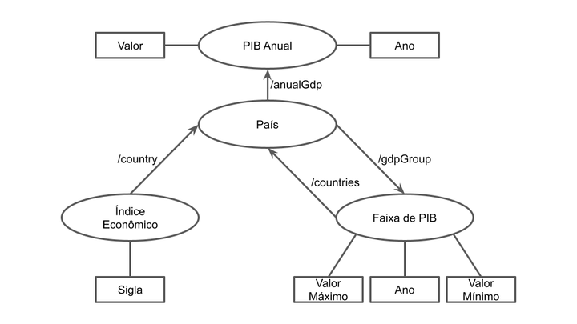

# Aluno
* César Guedes Carneiro
* 261031

## Modelo Lógico do Banco de Dados de Grafos

## Perguntas de Pesquisa/análise

> Liste aqui as três perguntas de pesquisa/análise
* Qual a variação percentual no valor de um índice no último ano?
* Qual a média de ganhos para os índices de um determinado país em um dia específico?
* A qual país um índice pertence e quais outros índices pertencem a este mesmo país?
