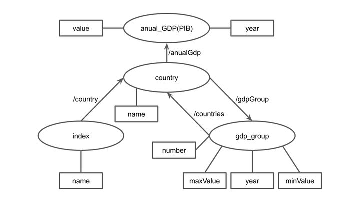

# Aluno
* César Guedes Carneiro
* 261031

## Modelo Lógico do Banco de Dados de Grafos

## Perguntas de Pesquisa/análise

> Liste aqui as três perguntas de pesquisa/análise
* Retorne o texto do nome de todos os índices que pertencem ao país “Brasil”.
~~~xquery
//index[country[name = "Brasil"]]/name/text()
~~~
* Retorne o texto de nome de todos os países que pertencem ao primeiro grupo de PIB.
~~~xquery
//gpd_group[number = "1"]/country/name/text()
~~~
* Para cada país, retorne um XML com elemento raiz <gdp2015>, contendo um elemento <country> com o nome do país, um elemento <value> com o valor do pib e um elemento <year> com o valor ‘2015’.
~~~xquery
for $i in (//country)
  return <gdp2015>
    <country>{$i/name/text()}</country>
    <value>{$i/anualGdp[year = "2015"]/value/text()}</value>
    <year>{"2015"}</year>
  </gdp2015>
~~~
